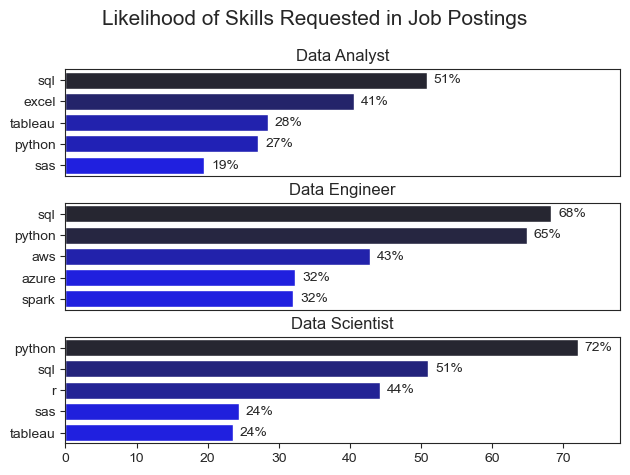
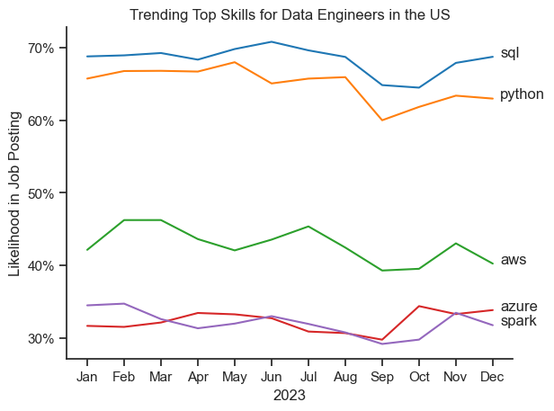
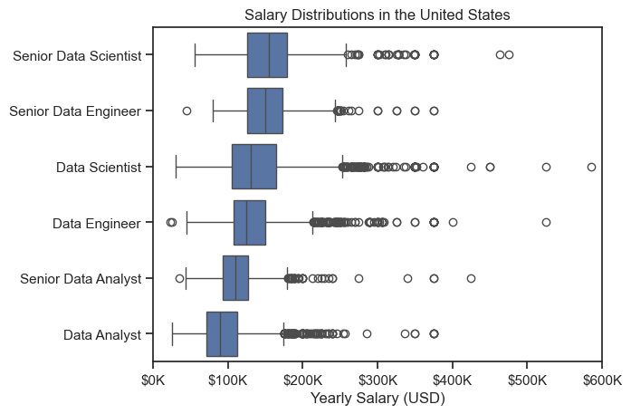
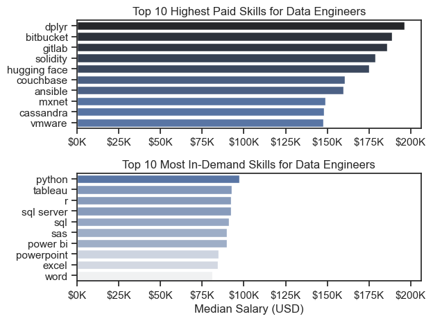

# Overview

Welcome to my analysis of the data job market, focusing on data engineer roles. This project was created out of a desire to navigate and understand the job market more effectively. It delves into the top-paying and in-demand skills to help find optimal job opportunities for data engineers.

The data sourced from [Luke Barousse's Python Course](https://lukebarousse.com/python) which provides a foundation for my analysis, containing detailed information on job titles, salaries, locations, and essential skills. Through a series of Python scripts, I explore key questions such as the most demanded skills, salary trends, and the intersection of demand and salary in data analytics.

# The Questions


Below are the questions I want to answer in my project:

1. What are the skills most in demand for the top 3 most popular data roles?
2. How are in-demand skills trending for Data Engineers?
3. How well do jobs and skills pay for Data Engineers?
4. What are the optimal skills for data engineers to learn? (High Demand AND High Paying)

# Tools I Used

For my deep dive into the data engineer job market, I harnessed the power of several key tools:

- **Python:** The backbone of my analysis, allowing me to analyze the data and find critical insights.I also used the following Python libraries:
    - **Pandas Library:** This was used to analyze the data. 
    - **Matplotlib Library:** I visualized the data.
    - **Seaborn Library:** Helped me create more advanced visuals. 
- **Jupyter Notebooks:** The tool I used to run my Python scripts which let me easily include my notes and analysis.
- **Visual Studio Code:** My go-to for executing my Python scripts.
- **Git & GitHub:** Essential for version control and sharing my Python code and analysis, ensuring collaboration and project tracking.

# Data Preparation and Cleanup

This section outlines the steps taken to prepare the data for analysis, ensuring accuracy and usability.

## Import & Clean Up Data

I start by importing necessary libraries and loading the dataset, followed by initial data cleaning tasks to ensure data quality.

```python
# Importing Libraries
import ast
import pandas as pd
import seaborn as sns
from datasets import load_dataset
import matplotlib.pyplot as plt  

# Loading Data
dataset = load_dataset('lukebarousse/data_jobs')
df = dataset['train'].to_pandas()

# Data Cleanup
df['job_posted_date'] = pd.to_datetime(df['job_posted_date'])
df['job_skills'] = df['job_skills'].apply(lambda x: ast.literal_eval(x) if pd.notna(x) else x)
```

## Filter US Jobs

To focus my analysis on the U.S. job market, I apply filters to the dataset, narrowing down to roles based in the United States.

```python
df_US = df[df['job_country'] == 'United States']

```

# The Analysis

Each Jupyter notebook for this project aimed at investigating specific aspects of the data job market. Here’s how I approached each question:

## 1. What are the most demanded skills for the top 3 most popular data roles?

To find the most demanded skills for the top 3 most popular data roles, I filtered out those positions by which ones were the most popular, and got the top 5 skills for these top 3 roles. This query highlights the most popular job titles and their top skills, showing which skills I should pay attention to depending on the role I'm targeting.

View my notebook with detailed steps here:
[2_Skill_Demand.ipynb](3_Project/2_Skill_Demand.ipynb)

### Visualize Data

```python
fig, ax = plt.subplots(len(job_titles),1)

for i, job_title in enumerate(job_titles):
    df_plot = df_skills_perc[df_skills_perc['job_title_short'] == job_title].head(5)
    sns.set_style('ticks')
    sns.barplot(data=df_plot, x='skill_percent', y='job_skills', ax=ax[i], hue='skill_count', palette='dark:b_r')
plt.show()
```

### Results



### Insights

- SQL is the foundational skill across all three roles, making it the most versatile technology for working with and querying data.
- Each role has a distinct technical focus: Data engineers emphasize Excel and Tableau, Data Engineers prioritize cloud and big data technologies (AWS, Azure, Spark), while Data Scientists focus on Python and statistical tools like R.
- Python demand increases with technical complexity, rising from 27% in Data engineer postings to 65% for Data Engineers and 72% for Data Scientists, highlighting its importance for automation, data engineering, and machine learning.

## 2. How are in-demand skills trending for Data Engineers?

### Visualize Data

```python

from matplotlib.ticker import PercentFormatter

df_plot = df_DE_US_percent.iloc[:, :5]

sns.lineplot(data=df_plot, dashes=False, palette='tab10')
sns.set_theme(style='ticks')

ax=plt.gca()
ax.yaxis.set_major_formatter(PercentFormatter(decimals=0))

```

### Results



### Insights

- SQL and Python remained the most consistently requested skills throughout 2023, with SQL maintaining the highest demand at around 65 to 71% of Data Engineer job postings.
- AWS consistently ranked as the leading cloud platform, while Azure and Spark remained secondary technologies with demand generally between 30 and 35%.
- Demand for core Data Engineering skills remained relatively stable over the year, with only modest month to month fluctuations, indicating that employers consistently value SQL, Python, cloud platforms, and big data technologies.

## 3. How well do jobs and skills pay for Data Engineers?

### Salary Analysis for Data Professionals

#### Visualize Data

```python
sns.boxplot(data=df_US_top6, x='salary_year_avg', y='job_title_short', order=job_order)
plt.xlim(0, 600000) 
ticks_x = plt.FuncFormatter(lambda y, pos: f'${int(y/1000)}K')
plt.gca().xaxis.set_major_formatter(ticks_x)
plt.show()

```

#### Results


*Box plot visualizing the salary distributions for the top 6 data job titles.*

#### Insights

- Senior roles consistently command higher salaries, with Senior Data Scientists and Senior Data Engineers showing the highest median salaries among the six job titles.
- Data Scientist and Data Engineer roles exhibit the widest salary ranges, indicating greater earning potential but also more variability depending on experience, industry, and company.
- All roles contain numerous high salary outliers exceeding $300K, suggesting opportunities for significantly higher compensation in specialized, senior, or high paying organizations.

### Highest Paid & Most Demanded Skills for Data Engineers

#### Visualize Data

```python
fig, ax = plt.subplots(2, 1)  

# Top 10 Highest Paid Skills for Data Engineers
sns.barplot(data=df_DE_top_pay, x='median', y=df_DE_top_pay.index, hue='median', ax=ax[0], palette='dark:b_r')
# Top 10 Most In-Demand Skills for Data Engineers
sns.barplot(data=df_DE_skills, x='median', y=df_DE_skills.index, hue='median', ax=ax[1], palette='light:b')
plt.show()
```



*Two separate bar graphs visualizing the highest paid skills and most in-demand skills for data engineers in the US.*

#### Insights:

- The highest paying Data Engineering skills are niche technologies, with tools like `dplyr`, `Bitbucket`, `GitLab`, and `Solidity` offering median salaries approaching or exceeding $180K.
- The most in demand skills differ from the highest paying skills. `Python`, `SQL`, `Tableau`, and `Excel` are requested most frequently, but they offer lower median salaries because they are foundational skills required across many roles.
- Specialized expertise commands a salary premium. While foundational skills help secure Data Engineering roles, mastering less common technologies can significantly increase earning potential.

## 4. What is the most optimal skill to learn for Data Engineers?

#### Visualize Data

```python
from adjustText import adjust_text
import matplotlib.pyplot as plt

sns.scatterplot(
    data=df_plot, 
    x='skill_percent', 
    y='median_salary',
    hue='technology'
)

plt.show()
```

#### Results


*A scatter plot visualizing the most optimal skills (high paying & high demand) for data engineers in the US.*

#### Insights

- Kafka provides the strongest balance of salary and demand, offering one of the highest median salaries (~$145K) while appearing in nearly 20% of Data Engineer job postings.
- Cloud and big data technologies such as AWS, Snowflake, Spark, and Airflow offer a favorable tradeoff between compensation and market demand, making them valuable skills for aspiring Data Engineers.
- SQL and Python are the most requested skills, but their salaries are lower than many specialized technologies, suggesting they are essential foundation skills while niche expertise commands higher pay.


# What I Learned

Throughout this project, I deepened my understanding of the data engineer job market and enhanced my technical skills in Python, especially in data manipulation and visualization. Here are a few specific things I learned:

- **Advanced Python Usage**: Utilizing libraries such as Pandas for data manipulation, Seaborn and Matplotlib for data visualization, and other libraries helped me perform complex data analysis tasks more efficiently.
- **Data Cleaning Importance**: I learned that thorough data cleaning and preparation are crucial before any analysis can be conducted, ensuring the accuracy of insights derived from the data.
- **Strategic Skill Analysis**: The project emphasized the importance of aligning one's skills with market demand. Understanding the relationship between skill demand, salary, and job availability allows for more strategic career planning in the tech industry.


# Insights

This project provided several general insights into the data job market for analysts:

- **Skill Demand and Salary Correlation**: There is a clear correlation between the demand for specific skills and the salaries these skills command. Advanced and specialized skills often lead to higher salaries.
- **Market Trends**: There are changing trends in skill demand, highlighting the dynamic nature of the data job market. Keeping up with these trends is essential for career growth in data engineering.
- **Economic Value of Skills**: Understanding which skills are both in-demand and well-compensated can guide data analysts in prioritizing learning to maximize their economic returns.


# Challenges I Faced

This project was not without its challenges, but it provided good learning opportunities:

- **Data Inconsistencies**: Handling missing or inconsistent data entries requires careful consideration and thorough data-cleaning techniques to ensure the integrity of the analysis.
- **Complex Data Visualization**: Designing effective visual representations of complex datasets was challenging but critical for conveying insights clearly and compellingly.
- **Balancing Breadth and Depth**: Deciding how deeply to dive into each analysis while maintaining a broad overview of the data landscape required constant balancing to ensure comprehensive coverage without getting lost in details.


# Conclusion

This exploration into the data engineer job market has been incredibly informative, highlighting the critical skills and trends that shape this evolving field. The insights I got enhance my understanding and provide actionable guidance for anyone looking to advance their career in data engineering. As the market continues to change, ongoing analysis will be essential to stay ahead in data engineering. This project is a good foundation for future explorations and underscores the importance of continuous learning and adaptation in the data field.
